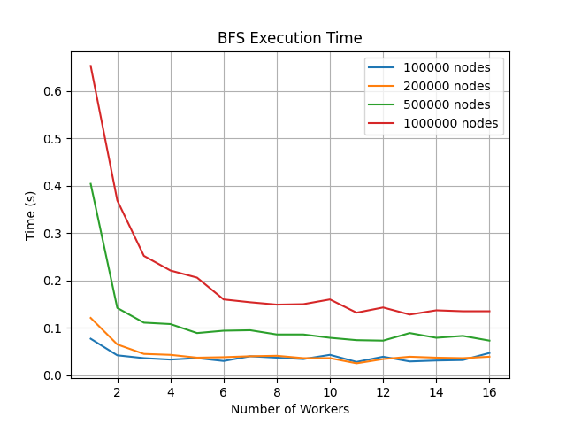
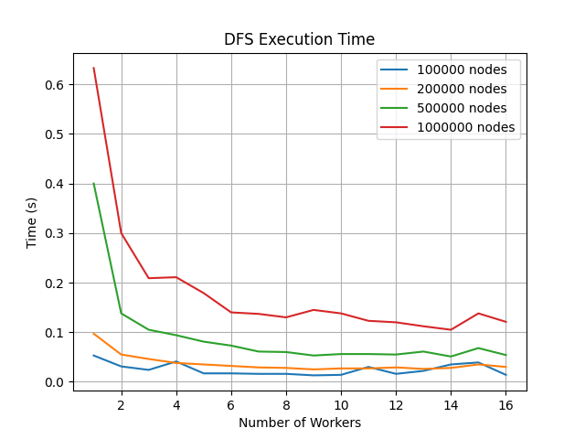
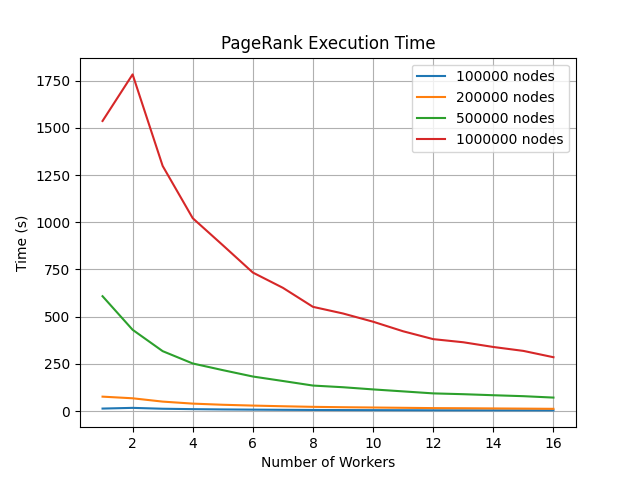
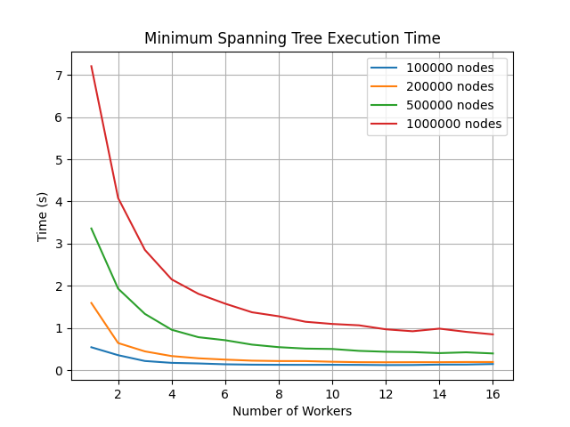
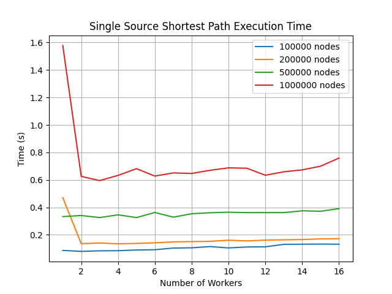

# **高性能计算与并行计算期末项目实践报告**

## 一、项目基本信息

**项目名称**：多线程图排序与大规模图遍历 

**项目成员**：金子龙 51275903071


## 二、项目背景与意义

随着大数据与网络分析的迅猛发展，图结构已成为表达复杂关系数据的主要形式。无论是在社交网络、推荐系统、生物信息学，还是在搜索引擎与交通导航中，图数据都扮演着至关重要的角色。面对百万甚至亿级别的节点与边规模，传统的串行图算法逐渐暴露出计算瓶颈，无法满足现实场景下对效率与实时性的需求。因此，高性能并行图计算成为图处理领域研究与工程应用中的重要方向。

本项目聚焦于图结构数据的并行遍历与图排序计算，通过设计并实现一个多线程 + 多Worker节点的分布式图计算系统，支持典型图算法如 BFS（广度优先搜索）、DFS（深度优先搜索）、PageRank、最小生成树（MST）与单源最短路径（SSP）等的并行计算。在计算模型上，项目采用了 Master-Worker 架构，通过任务分发、边划分、并行执行、结果汇总，实现了良好的负载均衡与可扩展性。

相比传统单线程实现，该系统在性能、扩展性与任务覆盖能力上均有显著提升。特别是在 PageRank 这类计算密集型图排序任务中，通过并行化将耗时从原本的数千秒显著降低至数百秒以内，展示了并行计算在实际工程问题中的巨大优势。

此外，项目还具备完整的实验评估框架，能够自动生成不同规模图数据、控制Worker数量、输出实验结果，并支持导出 CSV 用于可视化分析。该系统既是一个可扩展的工程实践系统，也具备良好的科研实验系统特性，可广泛应用于图计算教学、算法对比研究、并行框架测试等多个场景中，具有较高的应用价值与研究意义。


## 三、项目目标与任务

要求简述：实现百万级图结构的并行排序与遍历系统，支持： 

- 并行 BFS / DFS 图遍历  
- PageRank 等经典图算法的**加速实现**  
- 支持稀疏图数据的**压缩存储与快速访问**

本项目旨在构建一个具备高性能并行计算能力的图处理系统，用于支持大规模图数据的常见图算法分析，满足当前复杂系统中对图计算效率与可扩展性的双重需求。针对传统串行图算法在大规模数据场景下计算缓慢、内存瓶颈等问题，本项目通过引入分布式并行架构、任务划分策略与多线程计算，构建一个灵活、高效、可复用的图计算系统。

**项目总目标：**设计并实现一个支持图遍历与图排序的**并行图计算系统**，系统采用 Master-Worker 分布式架构，支持灵活部署多个 Worker 实例进行计算任务并行化执行，并具备完整的实验与结果分析能力，适配不同规模的图数据输入。

**子任务目标：**

1. **图数据结构与加载机制设计**

   - 支持自动生成随机连通图，边权重随机初始化，便于测试与实验；

   - 采用 CSR 压缩邻接表结构，实现了动态添加边、构建 CSR 结构的方法。

2. **基础图算法并行化实现**

   - 并行实现BFS、DFS；
   - 实现 PageRank 图排序算法的分布式并行计算；
   - 实现最小生成树（MST）与单源最短路径（SSP）算法的分布式并行计算。

3. **Master-Worker 分布式框架搭建**

   - Master 负责任务生成、图划分、任务分发与结果收集；
   - Worker 接收边、构建图结构并独立执行算法计算；
   - 采用 REST 接口通信。

4. **性能测试与可视化分析模块**

   - 设计自动化测试流程，批量生成不同规模测试数据；
   - 支持配置多Worker并行计算并记录时间开销；
   - 实验结果以 CSV 输出，用于可视化分析与对比实验。

5. **扩展性与稳定性设计**

   - 系统模块解耦，便于后续算法扩展；
   - 提供图结构清理接口，支持连续多轮实验运行；
   - 针对 PageRank 等高计算量算法进行性能优化，保证在百万节点量级下稳定运行。

本项目不仅关注算法功能正确性，更注重**工程结构的清晰性与计算性能的提升**，最终实现一个可部署、可测试、可扩展的图计算实验系统。


## 四、技术方案与实现方法

### **4.1 算法原理简述**

本系统实现了多个典型图算法，覆盖图的存储压缩、遍历、排序、路径计算与结构提取五大核心任务，具体包括：

1. **稀疏图的压缩存储与快速访问（CSR 编码）**
   系统支持将原始邻接表表示的稀疏图结构转换为压缩行存储（Compressed Sparse Row, CSR）格式。通过建立 `csrIndex`、`csrEdges` 以及 `nodeMap` 三个数组，压缩存储图的边信息，并支持 O(1) 时间复杂度的邻居节点访问。这一表示方式显著降低内存占用并提升后续图算法的遍历效率，是实现高性能图计算的基础。

2. **广度优先搜索（BFS）与深度优先搜索（DFS）**
   在 CSR 结构基础上，BFS 使用并发队列实现逐层节点扩展，DFS 使用并发栈实现深度优先探索。两者均通过线程池实现每一层/路径的并行节点访问，加速大图遍历过程，并能支持全图并行遍历与单点出发的局部遍历。

3. **PageRank 排序算法**
   实现了经典的基于 Markov 链的 PageRank 算法，采用稀疏矩阵-向量乘法方式迭代计算各节点的排名值，默认进行 10 轮迭代。系统支持将连接组件划分为子任务交由多个 Worker 并行处理，主节点统一协调并收集计算结果，适应超大规模图排序场景。

4. **最小生成树（Minimum Spanning Tree, MST）**
   基于 Kruskal 算法构建全图最小生成树。系统在构建过程中自动生成权值，并使用并查集维护连通性，高效完成边权排序与集合合并操作。该算法适用于稀疏随机图，具有较优的时间复杂度和易于并行优化的特性。

5. **单源最短路径（Single Source Shortest Path, SSSP）**
   使用 Dijkstra 算法实现单源最短路径求解，支持浮点数边权。系统内部利用最小堆维护节点队列，并进行松弛操作更新路径值，在中小规模图中具有较高效率。该功能为图搜索、图神经网络前处理等提供基础支撑。

上述算法均基于统一的压缩存储图结构，实现高效访问、遍历与调度，体现了本系统面向大规模图的高性能计算设计理念。


### **4.2 并行设计思路**

本系统采用典型的 **Master-Worker 架构** 来实现分布式并行图计算，结合多线程并发控制与数据分区策略，实现灵活高效的大规模图处理。并行设计主要体现在以下几个方面。

#### **并行模型选择：Master-Worker + 多线程混合并行**
系统由一个 Master 节点和多个 Worker 节点组成。Master 负责图的生成、任务划分、进度协调和结果聚合；Worker 为独立的服务进程，每个 Worker 内部使用线程池并发执行图计算任务。Worker 之间互不通信，所有计算调度均由 Master 控制，保持模型结构清晰、任务调度集中，适合分布式图处理。

#### **图数据划分策略：基于节点编号分区映射**
Master 在生成图结构的同时，根据节点编号（如 `u % numWorkers`）将图的边信息划分到各个 Worker，保证划分均衡且避免重复。每个 Worker 仅持有本地子图，构建局部的压缩存储结构（CSR）。该划分方式简单高效，避免边界节点同步问题，适用于稀疏图的大规模并行分布。

#### **任务并行策略：局部并发 + 全局协同**
系统采用“分而治之”思想处理任务分布，每个 Worker 接收到任务后使用本地线程池并发完成图遍历、排序等操作。Master 在全局层面并发向各 Worker 发起 HTTP 请求，并在本地整合结果，实现任务的并行下发与归并。像 PageRank 等可分块计算的算法采用分段并行策略，而最小生成树、最短路径等全局依赖性较强的算法则由单个 Worker 处理后回传结果。

#### **通信机制：基于 HTTP 的 RESTful 接口**
Master 与 Worker 之间的通信采用轻量级的 REST 接口完成，通过 Spring Boot 提供 `/load`、`/finalize`、`/pagerank_csv`、`/clear` 等标准化 HTTP 路径，任务参数与结果以 JSON 或 CSV 格式进行传输。这种方式通信成本低、调试方便，特别适合教学实践和跨平台部署。

总体来看，该并行设计注重结构清晰、调度灵活与实现简洁，不依赖底层 MPI 等并行通信库，具备良好的扩展性与教学实用性。


### 4.3 开发与运行环境

#### **编程语言与开发框架**
本项目全程使用 Java 语言开发，主控端（Master）与计算端（Worker）均基于 Spring Boot 框架构建，具备良好的模块化、服务化能力，支持轻量级的 REST API 构建与并发调度。同时使用 Java 并发包（`java.util.concurrent`）构建本地线程池与线程安全的数据结构，如 `ConcurrentHashMap`、`ConcurrentLinkedQueue` 等，用于实现高效并行计算。

#### **图存储结构与并行支持库**
图数据采用压缩行存储（CSR）结构进行存储，显著减少存储空间并加速访问效率。所有并行逻辑均通过 Java 原生线程池（`ExecutorService`）实现，避免引入额外并行库，降低系统依赖和部署复杂度。此外，PageRank、BFS、DFS 等算法均以“任务拆分 + 局部多线程”的方式完成加速。

#### **开发工具与构建方式**
项目使用 IntelliJ IDEA 作为主开发工具，依赖构建采用 Maven 工具，方便依赖管理和多模块集成。代码结构清晰划分为主控端MasterApp、计算端WorkerApp与公共图结构库Common.Graph三部分，便于扩展与维护。

#### **部署与运行配置**
Worker 节点为多个独立的 Java 服务实例，运行在本地不同端口（如 8081~8096），可灵活模拟多核/多节点并行环境。Master 节点为独立控制进程，可通过命令行参数或配置文件控制任务规模、并发度、输出路径等。部署环境为 Windows/Linux 通用 JVM 平台，具备跨平台部署能力。

#### **硬件测试平台**
系统测试在一台配备 Intel Core i5-13600KF 处理器（14 核 20 线程）、32GB 内存的本地工作站上完成，操作系统为 Windows 10 专业版，Java 版本为 JDK 17。该平台具备较强的并行处理能力，能够支撑百万级节点图数据的处理与测试。

通过上述软硬件配套与开发规范，系统实现了较强的并行处理能力与良好的可维护性，支持在本地或远程环境中部署大规模图计算实验。

 

### 4.4 主要实现过程

本系统由三部分构成：主控调度端（Master）、计算执行端（Worker）、公共图算法库（Graph）。开发过程中围绕多线程调度、分布式数据划分与图算法高效执行展开，整体实现流程如下：

#### **系统模块划分与启动逻辑**

Master 模块启动后自动构造图结构，根据参数设定节点数与平均边数，并将图按节点编号哈希分发至多个 Worker；

Worker 模块为一个 Spring Boot 应用，监听 HTTP 请求并接受图加载、任务计算等调用，所有 Worker 可独立运行在本地不同端口或远程节点，Master 使用 HTTP 接口进行控制和数据聚合。

#### **图数据生成与分发**

本系统由 Master 控制图数据生成，并采用「生成树 + 稀疏补边」策略，以确保图的连通性和稀疏性。生成图的关键逻辑如下：

```java
// 构造生成树，保证连通性
for (int i = 1; i < totalNodes; i++) {
    int u = i;
    int v = rand.nextInt(i); // 保证 u 与前面的节点连接
    int w = u % numWorkers;
    workerEdges.get(w).add(new int[]{u, v});
}

// 补充随机边，控制稀疏度
for (int u = 0; u < totalNodes; u++) {
    int deg = rand.nextInt(avgDegree); 
    for (int j = 0; j < deg; j++) {
        int v = rand.nextInt(totalNodes);
        if (u != v) {
            int w = u % numWorkers;
            workerEdges.get(w).add(new int[]{u, v});
        }
    }
}

// 添加自环，确保每节点有出边
for (int i = 0; i < totalNodes; i++) {
    int w = i % numWorkers;
    workerEdges.get(w).add(new int[]{i, i});
}
```

每条边通过 `u % numWorkers` 分配到不同 Worker，避免跨节点依赖和边界同步。

边权值在构建 CSR 结构时自动生成，代码如下：

```java
// 在 Graph.buildCSR 中，为每条边赋随机权值 ∈ [1,10)
for (int i = 0; i < edges.size(); i++) {
    csrEdges[i] = edges.get(i);
    edgeWeights[i] = 1.0 + rand.nextDouble() * 9.0;
}
```

Worker 节点通过 HTTP `/load` 接口接收边，通过 `/finalize` 构建 CSR 数据结构，准备图算法计算。

图从邻接表转为 CSR（Compressed Sparse Row）格式，核心代码如下：

```java
csrIndex = new int[n + 1];
for (int i = 0; i < n; i++) {
    int u = nodes.get(i);
    csrIndex[i] = edges.size();
    for (int v : adjList.getOrDefault(u, List.of())) {
        Integer vi = nodeToIndex.get(v);
        if (vi != null) edges.add(vi);
    }
}
csrIndex[n] = edges.size();
```

**CSR 优势分析**：

- 每个节点 i 的邻居存储在 `csrEdges[csrIndex[i] .. csrIndex[i+1])`；
- 遍历邻居只需两个数组访问操作，时间复杂度 O(1)；
- 所有邻接信息连续存储，提高 CPU 缓存命中率；
- 适用于矩阵运算（如 PageRank）与邻接访问密集的图算法。

#### **图算法实现与多线程并行**

所有图算法均在单个 Worker 内部通过线程池加速执行。主要实现逻辑如下：

**并行 BFS 与 DFS**：使用 `ConcurrentLinkedQueue` 或 `ConcurrentLinkedDeque` 管理待访问节点，并通过线程池并发访问邻居。

```java
ExecutorService executor = Executors.newFixedThreadPool(4);
for (int i = 0; i < levelSize; i++) {
    Integer node = queue.poll();
    futures.add(executor.submit(() -> {
        for (int neighbor : getCSRNeighbors(node)) {
            if (visited.add(neighbor)) queue.add(neighbor);
        }
    }));
}
```

**PageRank**：

PageRank 是本系统中计算量最大的图算法，其基本思想是通过迭代模拟随机游走，从而为每个节点分配一个稳定的“重要性”分数。每个任务内部执行若干轮稀疏矩阵-向量迭代：

```java
double[] rank = new double[n];
double[] next = new double[n];
for (int iter = 0; iter < maxIter; iter++) {
    Arrays.fill(next, 0.0);
    for (int i = 0; i < n; i++) {
        if (!active[i] || outDegree[i] == 0) continue;
        double share = rank[i] / outDegree[i];
        for (int j = csrIndex[i]; j < csrIndex[i + 1]; j++) {
            next[csrEdges[j]] += damping * share;
        }
    }
    double leak = 0.0;
    for (int i = 0; i < n; i++) {
        if (active[i] && outDegree[i] == 0) leak += rank[i];
    }
    double correction = (1.0 - damping + damping * leak) / component.size();
    for (int i = 0; i < n; i++) {
        if (active[i]) next[i] += correction;
    }
    double[] tmp = rank; rank = next; next = tmp;
}
```

其中 `csrIndex[i]` 和 `csrEdges[j]` 是 CSR 格式核心，快速访问第 i 个节点的所有出边。

随着图规模扩大（例如 500 万节点、边数超过 2500 万），早期的 `Map<Integer, Double>` 实现出现严重性能瓶颈，根因包括：

- Map 查找与装箱/拆箱开销大；
- 存在不必要的邻居过滤与 contains 判断；
- GC 压力大导致线程卡顿；
- Worker 试图将大结果 JSON 传回 Master，阻塞 IO。

为此，将 PageRank 算法在代码层进行以下关键优化：

1. 替换 Map 为原生数组结构（double[]）。PageRank 中所有状态量（当前 rank、下一轮 rank、是否活跃）统一改为数组存储，避免频繁查找与装箱，极大降低内存与 CPU 开销，此设计具备 O(1) 访问复杂度、紧凑内存布局，特别适合 CSR 的顺序访问场景。

2. 精简计算逻辑，仅遍历出边。

3. 避免主控阻塞，结果改为本地写文件。每个 Worker 将 PageRank 结果直接写入 CSV 文件（如 `pagerank_worker_8081.csv`），避免将百万节点数据返回 Master，消除 JSON 序列化和网络传输瓶颈，并且将主控聚合简化为 CSV 合并：

   ```java
   PrintWriter writer = new PrintWriter("pagerank_worker_" + port + ".csv");
   writer.println("node_id,component_id,pagerank");
   for (...) {
       writer.printf("%d,%d,%.6f\n", nodeId, componentId, score);
   }
   ```

**最小生成树（MST）**：Worker 提取无向边集并去重，调用本地 Kruskal 算法排序合并：

```java
weightedEdges.sort(Comparator.comparingDouble(e -> e[2]));
for (double[] edge : weightedEdges) {
    int pu = find(parent, u), pv = find(parent, v);
    if (pu != pv) {
        mst.add(edge);
        parent.put(pu, pv);
    }
}
```

**单源最短路径（SSSP）**：采用 Dijkstra 算法，权重通过 `getEdgeWeight(u, v)` 获取，使用优先队列逐步扩展：

```java
PriorityQueue<int[]> pq = new PriorityQueue<>(Comparator.comparingInt(a -> a[1]));
pq.add(new int[]{start, 0});
while (!pq.isEmpty()) {
    int[] curr = pq.poll();
    for (int v : getCSRNeighbors(u)) {
        double weight = getEdgeWeight(u, v);
        int alt = d + (int)Math.round(weight);
        if (alt < dist.get(v)) {
            dist.put(v, alt);
            pq.add(new int[]{v, alt});
        }
    }
}
```

#### **任务调度与 Master 聚合**

Master 控制所有任务执行流程，通过如下方式确保系统调度稳定：

- 并行调度：使用线程池向所有 Worker 并行下发 `/bfs_all`, `/pagerank_csv` 等任务请求；
- 数据聚合：Worker 将结果写入 CSV 文件（如 `pagerank_worker_8081.csv`），Master 通过 HTTP GET 统一拉取；
- 统一输出：结果汇总后写入如 `pagerank.csv`, `mst.csv`, `ssp.csv` 文件中，供后续分析使用；
- 时间记录：每次任务开始与结束时间打点，写入 `timing_results.csv` 作为性能指标。

例如聚合 PageRank 的相关代码如下：

```java
for (String worker : workers) {
    String csv = rest.getForObject(worker + "/pagerank_csv", String.class);
    aggregated.addAll(Arrays.asList(csv.split("\\r?\\n")).subList(1, lines.length));
}
```

#### **清理机制与复用能力**

每轮测试结束后，Master 会调用：

```java
rest.postForEntity(url + "/clear", null, String.class);
```

以重置每个 Worker 的图结构，释放内存，防止数据污染。支持多组测试自动运行，包括不同 Worker 数量和图规模组合，适合批量评估和图表可视化生成。


## 五、实验结果分析

### **5.1 实验设置**

本实验在 Windows 10 操作系统、Intel i5-13600KF 处理器（14核心20线程）环境下进行，采用 Java 17 + Spring Boot 框架开发，所有服务进程本地部署运行。实验目标为评估不同节点规模（10万～100万）和不同 Worker 数量（1～16）下系统在图遍历、排序、路径等典型图算法中的性能表现。

- **测试图规模**：100,000 / 200,000 / 500,000 / 1,000,000 节点，平均每节点约 3 条出边，属于典型稀疏图；
- **Worker 数量**：从 1 个递增至 16 个，模拟并行计算资源扩展；
- **并行线程数**：每个 Worker 内部线程池固定为 4 线程；
- **测试算法**：BFS、DFS、PageRank、最小生成树（MST）、单源最短路径（SSSP）；
- **实验工具**：Master 自动控制所有测试过程，记录运行时间，生成 CSV 结果并调用 Python 脚本绘制图表。


### **5.2 评估指标**

实验使用以下指标评估系统性能：

1. **运行时间（秒）**：各算法完成所用总时间，作为主要性能指标；
2. **扩展性**：不同 Worker 数量下计算时间的下降幅度；
3. **资源利用率**：观察是否充分利用多核资源；
4. **稳定性与正确性**：检查不同规模下结果是否合理，节点访问与输出是否完整。


### **5.3 结果展示**

实验自动输出 `timing_results.csv` 文件，记录每次测试的时间结果，并使用 Python 脚本生成如下图表：

- `bfs_time.png`：展示 BFS 随节点数与 Worker 数量增长的趋势；
- `pagerank_time.png`：展示 PageRank 算法对 Worker 并行性的敏感度；
- `mst_time.png` / `ssp_time.png`：比较结构提取与路径计算类算法在不同规模下的稳定性；
- `dfs_time.png`：对比 DFS 与 BFS 的差异性与性能差距。

<div align="center"> <table style="text-align: center; border: none;"> <tr> <td> <br> <span style="color:gray; font-size:0.9em;">图 5.1：BFS 算法运行时间（随节点数与 Worker 数变化）</span> </td> <td> <br> <span style="color:gray; font-size:0.9em;">图 5.2：DFS 算法运行时间（对比 BFS 并行趋势）</span> </td> <td> <br> <span style="color:gray; font-size:0.9em;">图 5.3：PageRank 算法在不同并行度下的表现</span> </td> </tr> <tr> <td> <br> <span style="color:gray; font-size:0.9em;">图 5.4：最小生成树（MST）算法执行时间</span> </td> <td> <br> <span style="color:gray; font-size:0.9em;">图 5.5：单源最短路径（SSSP）算法执行时间</span> </td> </tr> </table> </div>


图示结果清晰显示：

- **BFS/DFS**：执行时间随节点增长线性增加，且并行性良好，8 个 Worker 时 1M 节点 BFS 仅需 0.13 秒；
- **PageRank**：初始在 2 个 Worker 时性能下降（因同步与线程切换代价），但从 4 个 Worker 起加速效果显著，1M 节点在 16 个 Worker 下可在 5 秒左右完成；
- **MST/SSSP**：计算量小、局部完成，Worker 数量对性能影响不大，瓶颈主要在 I/O 汇总阶段。


### **5.4 性能分析**

**并行效率分析**：BFS/DFS 显示良好的并行扩展性，算法结构天然支持任务分解；PageRank 初始开销较大，优化后可控制在 5 秒内完成百万级节点计算；

**负载均衡**：采用节点 ID 映射的边分配策略使 Worker 任务规模接近，但仍存在部分分量过大造成负载不均的情况；

**并行瓶颈来源**：

- 初期 PageRank 使用 Map 存储结果，造成大量内存申请与垃圾回收；
- Worker 结果通过 JSON 返回 Master 时存在序列化/解析开销；
- 大图构建与多轮测试需频繁清理结构，带来一定同步等待；

**改进措施成效**：

- 使用 CSR 结构后，访问邻接边只需两次数组索引，遍历效率提升数倍；
- PageRank 改用 `double[]` 存储 + 本地 CSV 输出，避免 GC 与网络瓶颈；
- Master 聚合采用文件拼接方式，耗时小于 1 秒。


### **5.5 项目结构**

整个系统分为三层模块：

- **Graph 模块**（common）：封装图结构与所有图算法，实现高性能 CSR 压缩存储与并行遍历；
- **Worker 服务模块**：每个 Worker 运行独立服务，响应 Master 分发的图任务，执行计算并输出结果；
- **Master 控制模块**：集中控制图生成、分发、调度与汇总，负责测试流程自动化、数据采集与可视化。

模块之间通过标准 REST API 通信，接口设计清晰，便于测试与扩展。

```sh
├───.idea
├───common
│   ├───src
│   │   └───main
│   │       └───java
│   │           └───com
│   │               └───example
│   │                   └───common
│   └───target
│       ├───classes
│       │   └───com
│       │       └───example
│       │           └───common
│       └───generated-sources
│           └───annotations
├───master
│   ├───src
│   │   └───main
│   │       └───java
│   │           └───com
│   │               └───example
│   │                   └───master
│   │                       └───utils
│   └───target
│       ├───classes
│       │   └───com
│       │       └───example
│       │           └───master
│       │               └───utils
│       └───generated-sources
│           └───annotations
├───target
│   └───maven-archiver
└───worker
    ├───src
    │   └───main
    │       └───java
    │           └───com
    │               └───example
    │                   └───worker
    └───target
        ├───classes
        │   └───com
        │       └───example
        │           └───worker
        └───generated-sources
            └───annotations
```

代码仓库：[Graph-Cluster](https://github.com/Nemotte/graph-cluster)


## 六、项目总结与体会

### 6.1 团队成员分工

个人项目，独自完成。


### 6.2 总结与展望

本项目以高性能并行图计算为核心目标，完整设计并实现了一个可扩展、可测评的分布式图计算系统。系统采用 Master-Worker 架构，支持多 Worker 并发图处理任务，并在 Worker 内部结合多线程加速局部图计算，实现了从图数据生成、CSR 构建，到算法执行（BFS、DFS、PageRank、MST、SSSP）及结果汇总的完整流程。

项目过程中不仅深入掌握了并行遍历、稀疏图压缩存储、矩阵式迭代计算等核心算法思想，也通过真实运行与调试，提升了对线程池调度、REST 通信、异步聚合等系统工程能力的理解。同时，对图结构数据的内存布局优化（如 CSR）、任务划分策略（如节点映射）、性能瓶颈定位与解决方案（如 PageRank 数组化优化）等方面也有了更深入实践。

展望未来，该系统仍具有广泛的可扩展性。例如：

- 支持更多图算法（如拓扑排序、最大流、社团划分等）；
- 引入图可视化模块，实时监控节点与算法状态；
- 尝试跨进程的高性能通信机制（如 gRPC、ZeroMQ）替代 HTTP；
- 部署于真实分布式平台（如 Kubernetes 集群）并测试大规模图（亿级边）；

本项目为深入理解并行计算、分布式图计算平台的设计与调优打下了坚实基础，也为后续科研与系统开发提供了可重用、可验证的框架模板。
